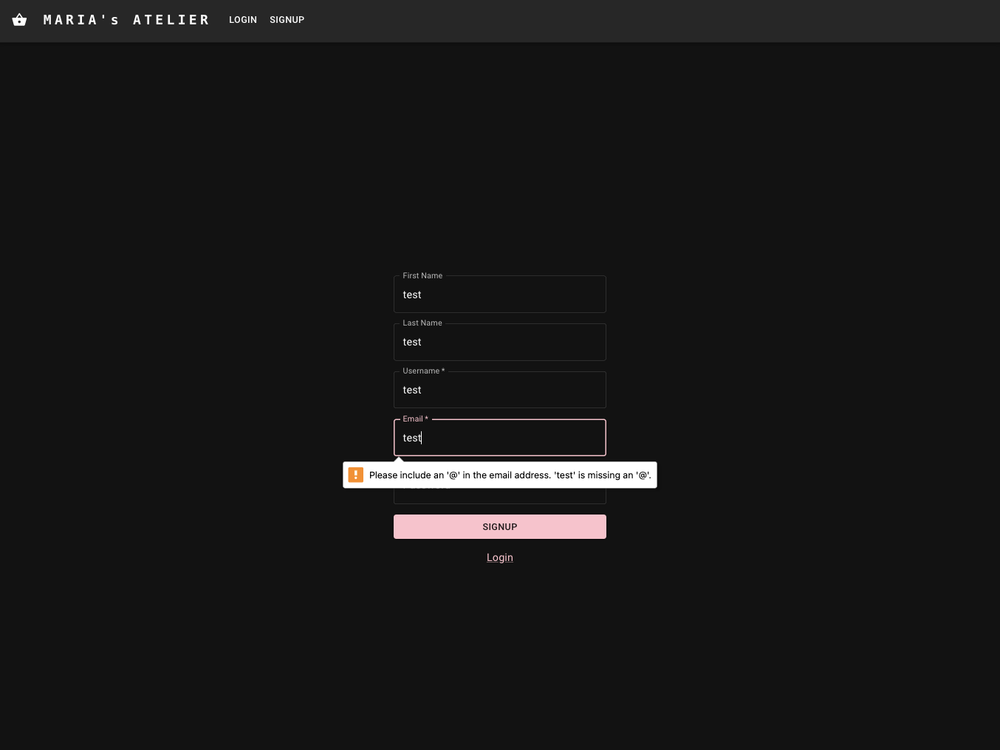
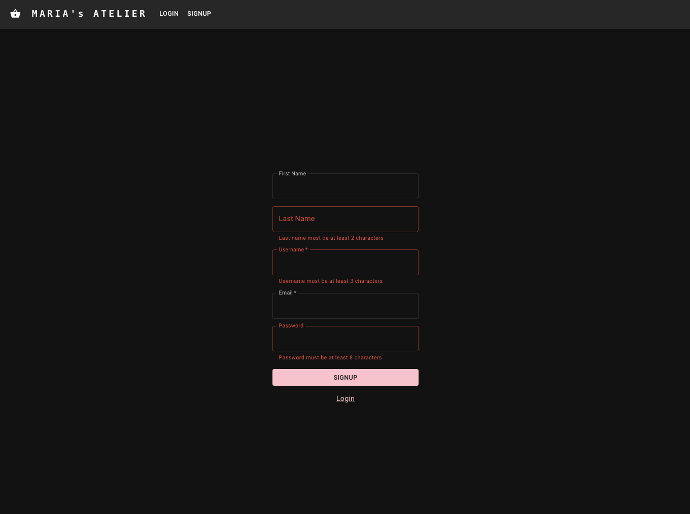
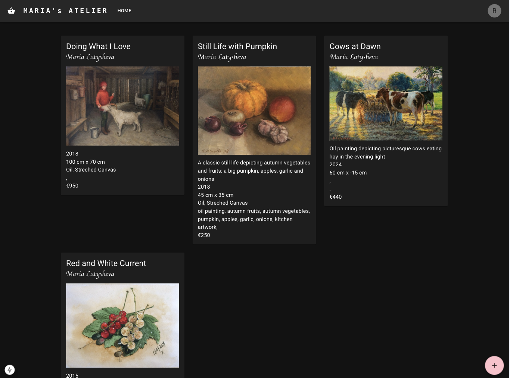
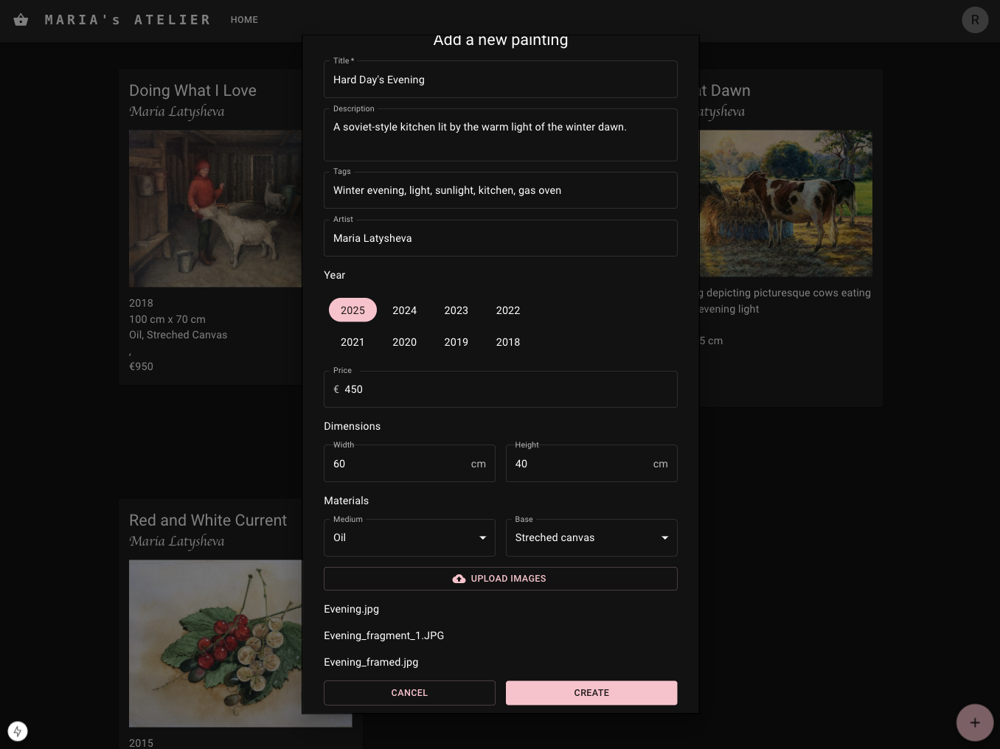
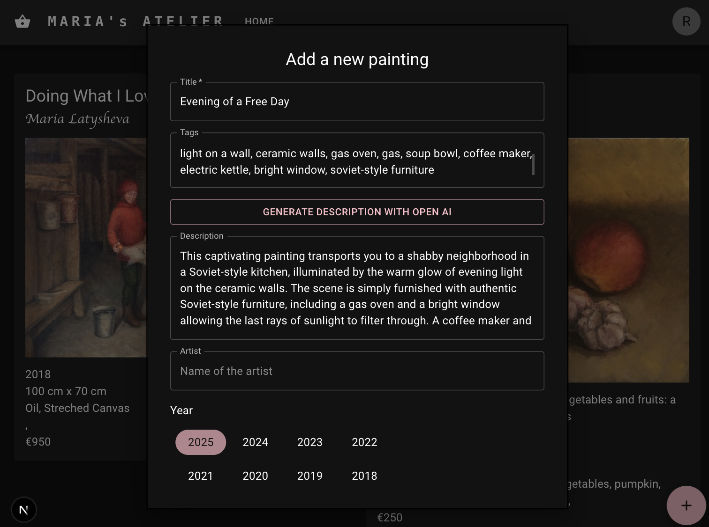
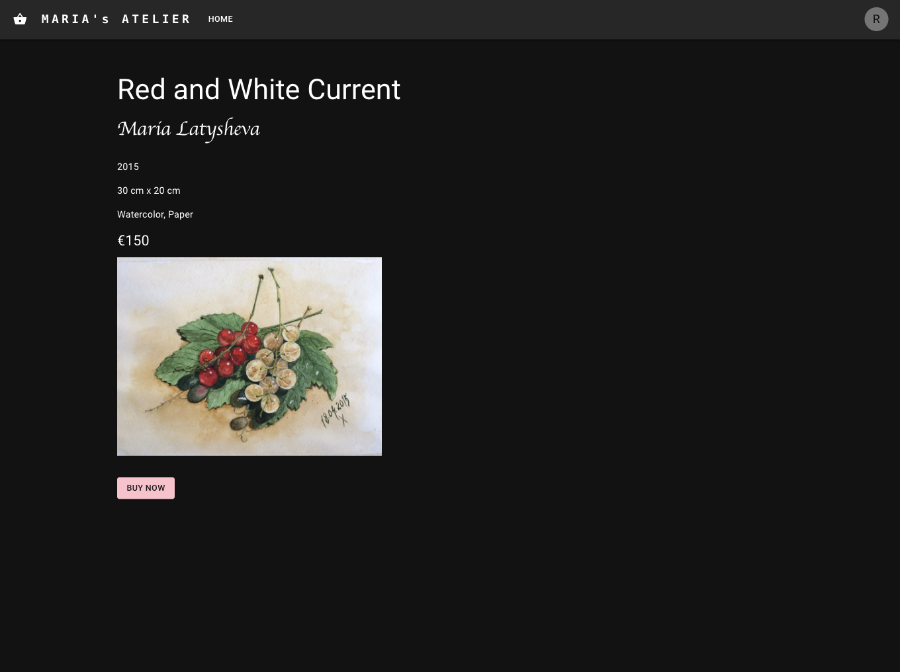
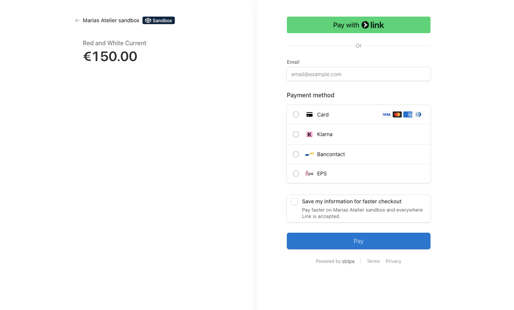
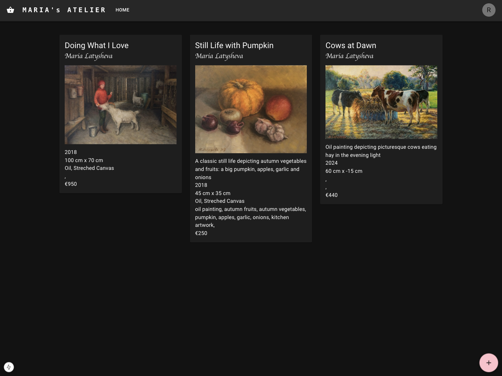

# Maria's Art Atelier frontend app

## Description

This is a Next.js React app bootstrapped with `create-next-app`.

The app provides the following functionality supported by the backend app (https://github.com/mlatysheva/marias-art-atelier-backend):
- Signing up a user using validation provided by the `zod` library
- Authenticating and logging the user based on cookies
- Providing the list of paintings available for sale
- Adding a new painting using validation provided by the `zod` library
- Using Open AI to automatically generate a description for the painting based on tags the user has provided
- Buying a selected painting using the `Stripe` interface
- Using websockets with `socket.io` to update the list of paintings in real time after a successful purchase

## Project setup

```bash
$ npm install
```

## Compile and run the project

```bash
# development
$ npm run dev
```

## Using the app 

After installing the dependencies with `npm install` and starting the app with `npm run dev`, the app will be running on `http://localhost:3000/` showing the signup/login screen.

Choose the signup screen and fill in the form:

The form uses built-in html validation:



The form also uses `zod` validation to provide more robust validation:



The screen showing all paintings available for purchase:



The user can add a painting for sale using the form with `zod` validation:



The user can automatically generate a description for the painting with Open AI 
based on the tags the user has provided:



The user can select a single painting:



Having clicked on the `Buy` button, the user is taken to the `Stipe` payment system to complete the purchase:



Use a Stripe test bank card from this page: https://docs.stripe.com/testing to make the purchase.

After a successful purchase, the list of available paintings is updated in real time using websocket connection:



## Stack used:
- React
- Next.js
- `zod` library to provide validation of user inputs
- Stripe to provide payment functionality
- Open AI API to automatically render a description for the painting based on tags
- Material UI
- `dayjs` library to render a calender
- `socket.io` library to use websockets
- `keen-slider` to render the images of a painting in a caroussel
